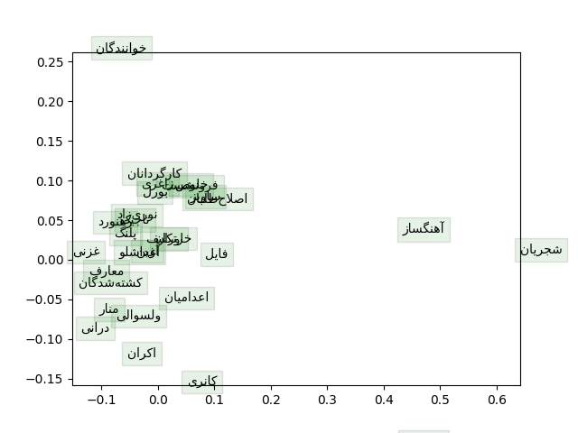

# BBC News Analysis
An NLP based project.
## Word2VEC
Word2Vec models with variouse number of parameters(5000, 10000, 15000,..., 35000) are trained on each class of the dataset. In this section Headline is concatenated with Body of each news as input text of the model. Each models trains through 40000 iterations. Trained models are saved in [models/word2vec](models/word2vec) directory. 30 most repeated words distribution on  a 2D map is illustrated on the following Image.
|  | 
|:--:| 
| *30 most repeated word distribution of ART class* |

Analysis of ART class distribution and other classes are discussed in prject [documentation](documents/main_v2.pdf).

This part generally is based on [assignment2_cs224n_2021 Stanford NLP course](http://web.stanford.edu/class/cs224n/assignments/a2.zip). 

## Tokenization
Both word-level and subword-Level 
## Language Model

## Finetuning LM 

## Dataset
Persian BBC News website is crawled on May/16/2021. Generated CSV file is located in [data](data) directory. Also other versions of dataset exits there. In [data/splited](data/splited) directory, preprocesed samples are classified by their news label and in each label train, dev and test data is splited. 

## More Details About This Project

Different version of fulldocuments are available [here](documents).

[Prpject Document](https://docs.google.com/document/d/1PBN1QmrI4QIE2bqm3R3kIKlj2fsblJLaVOc6nzjqGDM/edit?usp=sharing)
